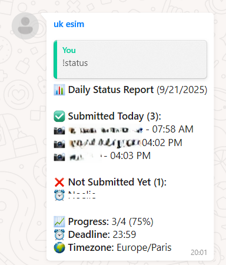
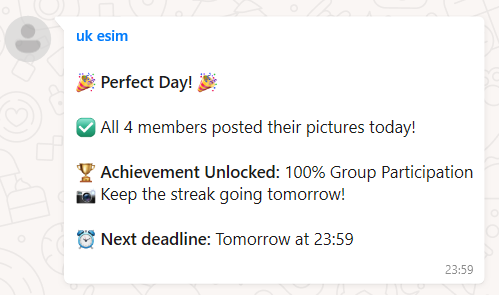
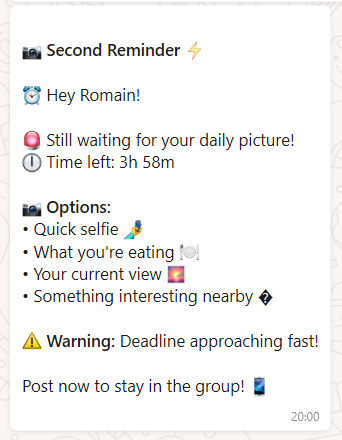

# A Pic a Day 📸

**Keep your friends and family connected, one picture at a time! 📸✨**

A WhatsApp bot that manages daily picture sharing groups for friends and family. Keep everyone engaged by ensuring each member posts one picture per day, with automatic enforcement and re-entry system.

> 📱 **See it in action**: Check out the [Screenshots & Examples](#-screenshots--examples) section to see the bot's interface and messaging system.

## ✨ Features

- **Daily Picture Enforcement**: Automatically tracks who has posted today
- **Smart Group Management**: Removes inactive members and allows easy re-entry
- **Rich Status Reports**: Beautiful emoji-based status messages
- **Comprehensive Statistics**: Track submission history and streaks
- **Automatic Reminders**: Configurable reminder times with individual DMs
- **Customizable Messaging**: Control group reminders and celebration messages
- **Grace Period**: Configurable grace period after deadline
- **Scheduled Tasks**: Automated daily enforcement with cron jobs
- **Persistent Storage**: SQLite database for reliable data management
- **Admin Commands**: Special commands for group administrators
- **Easy Setup**: Simple configuration and deployment
- **Docker Support**: Containerized deployment with Docker Compose
- **Production Ready**: Systemd service and health monitoring
## 🚀 Quick Start

### Prerequisites

- Node.js 16+ installed
- A dedicated WhatsApp account for the bot
- Linux server (for systemd service setup)

### 📱 Creating a Dedicated WhatsApp Account

The bot requires a **separate WhatsApp account** from your personal one. Here's how to set it up:

#### Option 1: Second Phone/SIM Card
- Use a separate phone or SIM card
- Install WhatsApp with a different phone number
- This is the most reliable method

#### Option 2: Dual App (Recommended for Android)
**Dual App** allows you to run two WhatsApp accounts on the same Android device:

1. **Enable Dual App**:
   - **Samsung**: Settings → Advanced Features → Dual App → WhatsApp
   - **Xiaomi/MIUI**: Settings → Dual Apps → WhatsApp  
   - **Huawei**: Settings → App Twin → WhatsApp
   - **OnePlus**: Settings → Utilities → Parallel Apps → WhatsApp
   - **Other Android**: Download "Dual Space" or "Parallel Space" from Play Store

2. **Setup Second WhatsApp**:
   - Install the duplicated WhatsApp app
   - Use a different phone number (you can use a virtual number service)
   - Complete the verification process

3. **Virtual Number Services** (if needed):
   - **Google Voice** (US only)
   - **Skype Number**
   - **TextNow** 
   - **2ndLine**
   - Most services offer free trials or low-cost numbers

#### Option 3: WhatsApp Business
- Install **WhatsApp Business** alongside regular WhatsApp
- Use a different phone number
- Both apps can run simultaneously on the same device

> 💡 **Pro Tip**: The bot account doesn't need to be your primary communication method - it just needs to stay online and linked to WhatsApp Web.

### Installation

1. **Clone the repository**
   ```bash
   git clone https://github.com/raomin/a-pic-a-day.git
   cd a-pic-a-day
   ```

2. **Install dependencies**
   ```bash
   npm install
   ```

3. **Setup database**
   ```bash
   npm run setup
   ```

4. **Configure environment**
   ```bash
   cp .env.example .env
   # Edit .env with your settings
   ```

5. **Start the bot**
   ```bash
   npm start
   ```

6. **Scan QR code** with your dedicated WhatsApp account

7. **Add bot to group**: Add the bot's phone number to your group and make it an admin

8. **Get group ID**: Check the logs for the group ID and update your `.env` file

## 🐳 Docker Deployment

### Prerequisites

- Docker and Docker Compose installed
- A dedicated WhatsApp account for the bot

### Quick Docker Setup

1. **Clone the repository**
   ```bash
   git clone https://github.com/raomin/a-pic-a-day.git
   cd a-pic-a-day
   ```

2. **Run the setup script**
   ```bash
   ./docker-setup.sh
   ```

3. **Configure environment**
   ```bash
   # Edit the Docker environment file
   nano data/.env
   # Set: TARGET_GROUP_ID, BOT_ADMIN_PHONE, TIMEZONE, etc.
   ```

4. **Start the bot**
   ```bash
   docker-compose up -d
   ```

5. **View logs and scan QR code**
   ```bash
   docker-compose logs -f
   # Scan the QR code with your WhatsApp account
   ```

6. **Add bot to group**: Add the bot's phone number to your group and make it an admin

### Docker Management Commands

```bash
# Start the bot
docker-compose up -d

# Stop the bot
docker-compose down

# View logs
docker-compose logs -f

# Restart the bot
docker-compose restart

# Update the bot
docker-compose down
docker-compose build --no-cache
docker-compose up -d

# Check status
docker-compose ps
```

### Docker File Structure

```
a-pic-a-day/
├── Dockerfile              # Container definition
├── docker-compose.yml      # Service configuration
├── docker-setup.sh         # Setup script
└── data/                   # Persistent data
    ├── .env                # Environment configuration
    ├── database/           # SQLite database
    ├── logs/               # Application logs
    └── auth/               # WhatsApp authentication
```

## 📱 Bot Registration & WhatsApp Setup

After starting the bot (either via npm or Docker), you need to register it with WhatsApp Web. This process only needs to be done once.

### 🔐 QR Code Authentication

1. **Start the bot** and monitor the logs:
   
   **Regular installation:**
   ```bash
   npm start
   # or check logs
   tail -f logs/combined.log
   ```
   
   **Docker installation:**
   ```bash
   docker-compose logs -f
   ```

2. **Wait for QR code** to appear in the terminal:
   ```
   [INFO] WhatsApp Web client is ready!
   [INFO] QR Code generated. Please scan with your WhatsApp app.
   
   ████ ████ ████ ████ ████
   ████      ████      ████
   ████ ████ ████ ████ ████
   ████      ████      ████
   ████ ████ ████ ████ ████
   ```

3. **Scan the QR code**:
   - Open WhatsApp on your **dedicated bot account**
   - 📱 **Using Dual App?** Open the second WhatsApp instance (look for the twin app icon)
   - Go to **Settings** → **Linked Devices** 
   - Tap **Link a Device**
   - Scan the QR code displayed in your terminal

4. **Verify connection**:
   ```
   [INFO] WhatsApp Web client authenticated successfully!
   [INFO] Client is ready! Bot is now active.
   ```

### 📝 Important Notes

- **Dedicated Account**: Use a separate WhatsApp account/phone number for the bot (preferred)
- **Keep Session Active**: The bot will remember the login session across restarts
- **Authentication Files**: Session data is stored in `.wwebjs_auth/` (regular) or `data/auth/` (Docker)
- **Re-authentication**: If the QR code appears again, your session expired - simply scan again
- **Timeout**: QR codes expire after ~20 seconds - refresh logs if needed

### 🔧 Troubleshooting Authentication

**QR Code doesn't appear:**
- Check if WhatsApp Web is accessible from your server
- Ensure no firewall is blocking the connection
- Restart the bot and check logs for errors

**Authentication fails:**
- Make sure you're using the correct WhatsApp account
- Clear authentication data and try again:
  ```bash
  # Regular installation
  rm -rf .wwebjs_auth/
  
  # Docker installation  
  rm -rf data/auth/
  ```

**Session keeps expiring:**
- Your phone might be offline too often
- WhatsApp may have logged out the session from the phone
- Check WhatsApp → Settings → Linked Devices on your phone

## ⚙️ Configuration

### Regular Installation
Create a `.env` file based on `.env.example`:

### Docker Installation
Edit `data/.env` file (automatically created by `docker-setup.sh`):

```env
# WhatsApp Group Configuration
TARGET_GROUP_ID=120363423539891503@g.us

# Bot Settings
DAILY_DEADLINE_HOUR=23
DAILY_DEADLINE_MINUTE=59

# Reminder Times (3 reminders per day)
DAILY_REMINDER_HOUR=18      # First reminder (6 PM)
DAILY_REMINDER_HOUR_2=20    # Second reminder (8 PM)  
DAILY_REMINDER_HOUR_3=22    # Final reminder (10 PM)

TIMEZONE=America/New_York
GRACE_PERIOD_MINUTES=120

# Daily summary settings
SEND_DAILY_SUMMARY_ON_PERFECT_DAY=true  # Send "Perfect Day" message when everyone submits
SEND_GROUP_REMINDERS=true               # Send group reminder messages (DMs always sent)

# Admin Settings
BOT_ADMIN_PHONE=1234567890@c.us

# Debug Mode
DEBUG=false
NODE_ENV=production
```

### Configuration Options

| Variable | Description | Default | Required |
|----------|-------------|---------|----------|
| `TARGET_GROUP_ID` | WhatsApp group ID to monitor | - | Yes |
| `DAILY_DEADLINE_HOUR` | Hour (24h format) for daily deadline | 23 | No |
| `DAILY_DEADLINE_MINUTE` | Minute for daily deadline | 59 | No |
| `DAILY_REMINDER_HOUR` | Hour for first daily reminder | 18 | No |
| `DAILY_REMINDER_HOUR_2` | Hour for second daily reminder | 20 | No |
| `DAILY_REMINDER_HOUR_3` | Hour for final daily reminder | 22 | No |
| `TIMEZONE` | Timezone for scheduling | America/New_York | No |
| `GRACE_PERIOD_MINUTES` | Grace period after deadline | 60 | No |
| `SEND_DAILY_SUMMARY_ON_PERFECT_DAY` | Send "Perfect Day" message when everyone submits | true | No |
| `SEND_GROUP_REMINDERS` | Send group reminder messages (DMs always sent) | true | No |
| `BOT_ADMIN_PHONE` | Admin WhatsApp number | - | No |
| `DEBUG` | Enable debug logging | false | No |

### Message Control Options

**Daily Summary Settings:**
- `SEND_DAILY_SUMMARY_ON_PERFECT_DAY=false`: Disables the "Perfect Day" celebration message when everyone submits their picture. The bot will still send enforcement reports when people are removed.

**Reminder Settings:**
- `SEND_GROUP_REMINDERS=false`: Disables group reminder messages while keeping individual DMs. This creates a quieter group experience while still notifying people privately.

> **Note**: Individual DM reminders to users who haven't posted are always sent regardless of the `SEND_GROUP_REMINDERS` setting.

### Usage Scenarios

**Quiet Group Mode**: For groups that prefer minimal group chat noise
```env
SEND_GROUP_REMINDERS=false
SEND_DAILY_SUMMARY_ON_PERFECT_DAY=false
```
- ✅ Individual DMs are sent to remind users privately
- ❌ No group reminder messages clutter the chat
- ✅ Enforcement reports are still sent when people are removed
- ❌ No celebration messages on perfect days

**Default Mode**: Full engagement with group participation
```env
SEND_GROUP_REMINDERS=true
SEND_DAILY_SUMMARY_ON_PERFECT_DAY=true
```
- ✅ Group reminders create social pressure and awareness
- ✅ Perfect day celebrations encourage group motivation
- ✅ All enforcement and progress messages are shared

### Reminder Schedule

The bot sends **3 escalating reminders** throughout the day:

1. **First Reminder** (default 6:00 PM): Gentle reminder with friendly tone
2. **Second Reminder** (default 8:00 PM): More urgent with deadline emphasis  
3. **Final Reminder** (default 10:00 PM): Final warning with urgent tone

> **Note**: If you only set `DAILY_REMINDER_HOUR`, the other two will automatically be calculated as +2 and +4 hours.

## 👥 Group Member Management

The bot automatically manages group members:

- **Auto-Detection**: The bot automatically detects group members by scanning WhatsApp group participants
- **Real-time Updates**: When someone joins or leaves the group, the bot updates its internal database
- **Status Tracking**: Each member's submission status is tracked daily
- **Removal & Re-entry**: Members who miss the deadline are removed but can rejoin by sending a picture to the bot

### Member Lifecycle

1. **Join Group**: User is added to WhatsApp group → Bot detects and adds to database
2. **Daily Submissions**: User posts pictures daily before deadline
3. **Miss Deadline**: User doesn't post → Removed from group after grace period
4. **Re-entry**: User sends picture to bot → Automatically re-added to group

## 🤖 Bot Commands

### Group Commands
Use these commands in the monitored WhatsApp group:

- **`!status`** - Show today's submission status with emojis
- **`!stats`** - Display comprehensive submission statistics  
- **`!help`** - Show help message with available commands

### Private Commands
Send these directly to the bot:

- **`/myinfo`** or **`!myinfo`** - View your personal submission information and statistics
- **`/help`** or **`!help`** - Show help message

### Admin Commands
Available to configured admin users (send privately to bot):

- **`/remind`** - Manually trigger daily reminders for testing
- **`/testdm`** - Send a test DM to verify direct messaging functionality
- **`/settings`** - View current bot configuration and settings
- **`/whoami`** - Debug command to verify admin status and phone number
- **`!admin`** - Show admin panel with member management options (in group)

## 📊 Screenshots & Examples

> 🎨 **Beautiful Interface**: The bot uses rich emoji-based messages and clear status indicators to create an engaging user experience.

### 📈 Daily Status Display
The `!status` command shows who has submitted today with beautiful emoji indicators:



**Status Indicators:**
- ✅ **Green Check**: User has submitted their picture today
- ⏳ **Hourglass**: User hasn't submitted yet (still time left)
- ❌ **Red X**: User missed the deadline
- 📈 **Progress Bar**: Shows completion percentage and time remaining

---

### 📊 Daily Enforcement Report
When the deadline passes, the bot automatically generates an enforcement report:



**Report Features:**
- ✅ **Submitted Today**: List of members who posted pictures
- ❌ **Removed Members**: List of users removed for missing deadline
- ⏰ **Next Deadline**: Information about tomorrow's requirements
- 📋 **Helpful Tips**: Reminder about available commands

### � Reminder Messages
The bot sends escalating reminder messages throughout the day:



**Reminder Types:**
- 🔔 **First Reminder (6 PM)**: Gentle notification with friendly tone
- ⚡ **Second Reminder (8 PM)**: More urgent with deadline emphasis
- 🚨 **Final Reminder (10 PM)**: Last warning with urgent tone
- 📱 **Individual DMs**: Private messages sent to each user who hasn't posted

---

> 💡 **Pro Tip**: All reminder messages include dynamic time calculations and can be customized through the configuration settings.

## 🔧 Advanced Setup

### Docker Production Deployment

For containerized production deployment:

```bash
# Clone and setup
git clone https://github.com/raomin/a-pic-a-day.git
cd a-pic-a-day
./docker-setup.sh

# Configure environment
nano data/.env

# Deploy with auto-restart
docker-compose up -d

# Enable auto-start on system boot
# Add to /etc/systemd/system/a-pic-a-day-docker.service:
sudo tee /etc/systemd/system/a-pic-a-day-docker.service > /dev/null <<EOF
[Unit]
Description=A Pic a Day Bot Docker Container
Requires=docker.service
After=docker.service

[Service]
Type=oneshot
RemainAfterExit=yes
WorkingDirectory=/path/to/a-pic-a-day
ExecStart=/usr/bin/docker-compose up -d
ExecStop=/usr/bin/docker-compose down
TimeoutStartSec=0

[Install]
WantedBy=multi-user.target
EOF

sudo systemctl enable a-pic-a-day-docker.service
```

### Systemd Service (Linux)

For traditional systemd deployment:

```bash
# The bot includes a service management script
./manage-service.sh enable    # Enable auto-start at boot
./manage-service.sh start     # Start the service
./manage-service.sh status    # Check service status
./manage-service.sh logs      # View recent logs
```

### Service Management Commands

```bash
# Docker commands
docker-compose up -d              # Start container
docker-compose down               # Stop container
docker-compose logs -f            # Follow logs
docker-compose restart            # Restart container

# Traditional service commands
./manage-service.sh start          # Start the bot service
./manage-service.sh stop           # Stop the bot service  
./manage-service.sh restart        # Restart the bot service
./manage-service.sh status         # Show current status
./manage-service.sh logs           # Show recent log entries
./manage-service.sh follow-logs    # Follow logs in real-time
./manage-service.sh enable         # Enable service at boot
./manage-service.sh disable        # Disable service at boot
```

## 📁 Project Structure

```
a-pic-a-day/
├── src/
│   ├── bot.js                 # Main bot class with WhatsApp event handling
│   ├── index.js              # Entry point and graceful shutdown
│   ├── setup.js              # Database initialization script
│   ├── models/
│   │   └── Database.js       # SQLite database connection and schema
│   ├── services/
│   │   ├── UserService.js    # User management business logic
│   │   ├── GroupService.js   # Group management business logic
│   │   └── SubmissionService.js  # Submission tracking business logic
│   └── utils/
│       ├── config.js         # Configuration management
│       └── logger.js         # Winston logging setup
├── manage-service.sh          # Service management script
├── package.json
└── README.md
```

## 🛠️ Development

### Prerequisites for Development

```bash
npm install -g nodemon
```

### Development Commands

```bash
npm run dev          # Start with auto-reload
npm run setup        # Initialize database
npm start           # Start production mode
```

### Database Schema

The bot uses SQLite with the following tables:

- **users**: User information and status tracking
- **submissions**: Daily submission records  
- **group_settings**: Group-specific configuration

## 📋 Requirements

### Bot Permissions

The bot must be an admin in the WhatsApp group to:
- Remove members who miss deadlines
- Re-add members who send pictures
- Send messages to the group
- Access group participant information

### WhatsApp Account

- Use a dedicated WhatsApp account for the bot
- Keep the bot's phone connected and online
- Ensure stable internet connection for the server

## 🔍 Troubleshooting

### Common Issues

**Bot not responding to commands:**
- Check if bot is admin in the group
- Verify group ID in configuration
- Check bot logs for errors

**Members not being removed:**
- Ensure bot has admin permissions
- Check timezone configuration
- Verify cron jobs are running

**QR code not appearing:**
- Restart the bot
- Check terminal/console output
- Ensure no other WhatsApp Web sessions are active

**Docker-specific issues:**
- Container won't start: Check `docker-compose logs`
- Permission errors: Ensure data directory permissions are correct
- Port conflicts: Change port in `docker-compose.yml`
- Memory issues: Increase Docker memory limits

### Logs

Check bot logs for detailed information:

**Regular installation:**
```bash
./manage-service.sh logs
# or
tail -f logs/combined.log
```

**Docker installation:**
```bash
docker-compose logs -f
# or
docker logs a-pic-a-day-bot
```

## 🤝 Contributing

Contributions are welcome! This project helps friends and families stay connected through daily photo sharing.

### Development Setup

1. Fork the repository
2. Create a feature branch
3. Make your changes
4. Test thoroughly
5. Submit a pull request

### Guidelines

- Follow existing code style
- Add tests for new features
- Update documentation as needed
- Keep commits atomic and well-described

## 📄 License

This project is licensed under the MIT License - see the [LICENSE](LICENSE) file for details.

## 🙏 Acknowledgments

This project is built with:

### Core Dependencies
- **[whatsapp-web.js](https://wwebjs.dev/)** - WhatsApp Web API client for Node.js
- **[sqlite3](https://github.com/TryGhost/node-sqlite3)** - SQLite database driver for reliable data persistence
- **[node-cron](https://github.com/node-cron/node-cron)** - Task scheduler for automated daily operations
- **[winston](https://github.com/winstonjs/winston)** - Professional logging library with multiple transports
- **[dotenv](https://github.com/motdotla/dotenv)** - Environment variable management
- **[qrcode-terminal](https://github.com/gtanner/qrcode-terminal)** - QR code generation for WhatsApp authentication

### Special Thanks
- **Claude** - AI assistant that helped architect and develop most of this project

## 📞 Support

If you encounter issues or have questions:

1. Check the [troubleshooting section](#-troubleshooting)
2. Review the [issues page](https://github.com/raomin/a-pic-a-day/issues)
3. Create a new issue with detailed information

---

